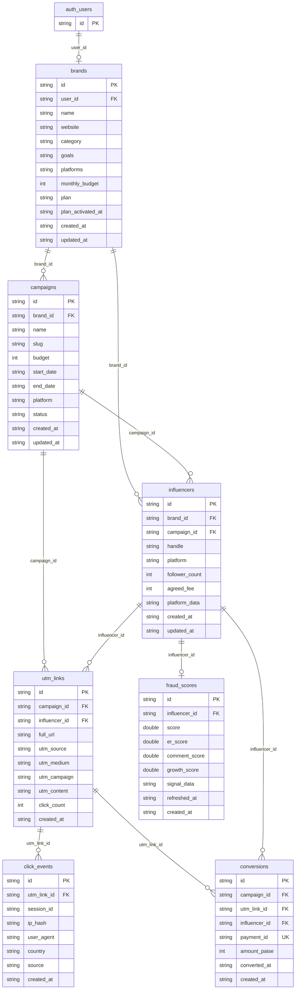

# Influro — Database schema (visual)

Single source: **`schema.sql`**. This diagram and `schema-diagram.html` use the same Mermaid definition (types simplified for Mermaid: string / int / double).

---

## Entity-relationship diagram (Mermaid)



---

## Flow (high level)

```
auth.users  →  brands  →  campaigns  →  influencers  →  utm_links  →  click_events
                    ↘       ↘                ↘  utm_links  →  conversions
                         influencers (brand_id)  fraud_scores (per influencer)
```

---

## Table summary (from schema.sql)

| Table | Purpose |
|-------|--------|
| **brands** | One per user (onboarding); RLS by `user_id`. Columns: id, user_id, name, website, category, goals, platforms, monthly_budget, plan, plan_activated_at, created_at, updated_at |
| **campaigns** | Per brand; slug for UTM. Columns: id, brand_id, name, slug, budget, start_date, end_date, platform, status, created_at, updated_at |
| **influencers** | Per brand + campaign; brand_id for cross-campaign. Columns: id, brand_id, campaign_id, handle, platform, follower_count, agreed_fee, platform_data, created_at, updated_at |
| **utm_links** | One per campaign+influencer; UNIQUE(campaign_id, influencer_id). Columns: id, campaign_id, influencer_id, full_url, utm_source, utm_medium, utm_campaign, utm_content, click_count, created_at |
| **click_events** | Each UTM hit; source IN (influencer, untracked-organic). Columns: id, utm_link_id, session_id, ip_hash, user_agent, country, source, created_at |
| **conversions** | Razorpay webhook; payment_id UNIQUE; campaign_id denormalised. Columns: id, campaign_id, utm_link_id, influencer_id, payment_id, amount_paise, converted_at, created_at |
| **fraud_scores** | Bot score 0–1 + signal breakdown; UNIQUE(influencer_id). Columns: id, influencer_id, score, er_score, comment_score, growth_score, signal_data, refreshed_at, created_at |

---

**PDF:** Open `schema-diagram.html` in a browser → Print → Save as PDF.
